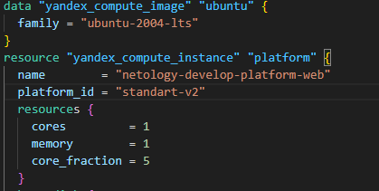
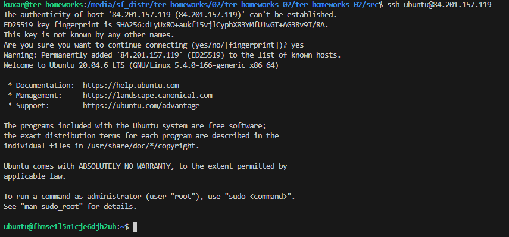
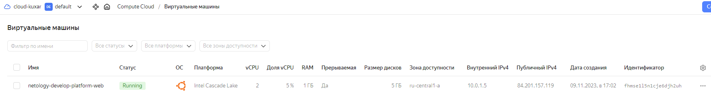
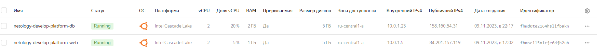
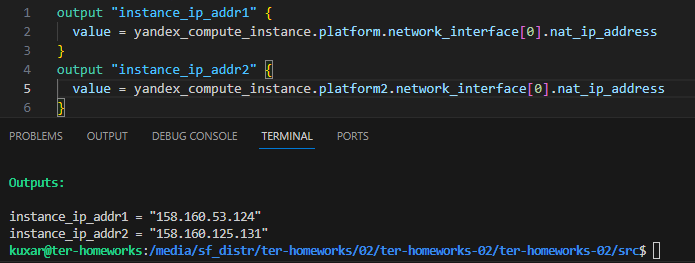
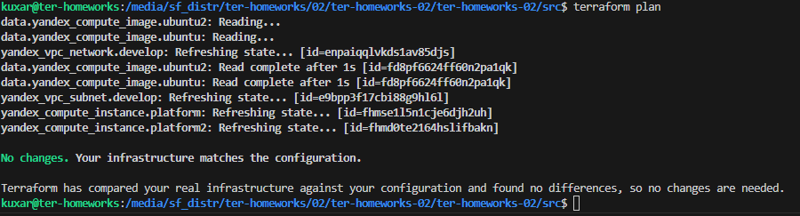
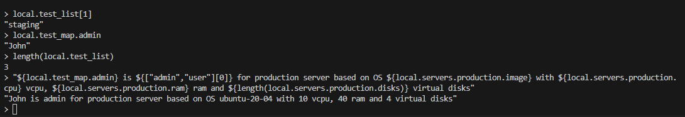

Задание 0

1. +
2. Непонял какой тип обращение создать тех поддержке. Думаю пойму на следующем вэбинаре.
    

Задание 1
1. +
2. +
3. +
4. Ошибка возможности созданиея платформы версии 4







  ```preemptible = true``` - scheduling_policy — политика планирования. Чтобы создать прерываемую ВМ, укажите preemptible = true.
  ```core_fraction=5``` - Уровни производительности vC
PU. Минимальные конфигурации указаны для уровня производительности 5%, максимальные — для 100%

Задание 2
1. +
2. +
3. +

Задание 3
1. +
2. +
3. +
   


Задание 4



Задание 5,6



Задание 7



> local.test_list[1]

"staging"

> local.test_map.admin

"John"

> length(local.test_list)

3

> "${local.test_map.admin} is ${keys(local.test_map)[0]} for production server based on OS ${local.servers.production.image} with ${local.servers.production.cpu} vcpu, ${local.servers.production.ram} ram and ${length(local.servers.production.disks)} virtual disks"

"John is admin for production server based on OS ubuntu-20-04 with 10 vcpu, 40 ram and 4 virtual disks"

# 
